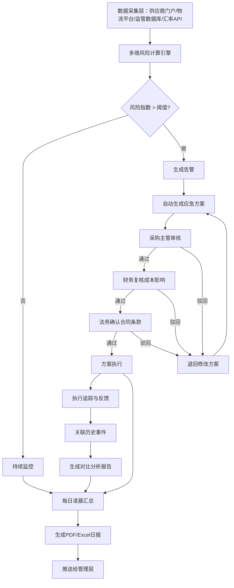

## 1. 产品概述

全球供应链智能风控平台——面向大型制造与贸易企业，基于多维模型实时评估供应链路径综合风险指数，自动触发应急方案与多级审批流，并生成趋势分析报告，帮助企业实现供应链风险的主动预防与敏捷响应。
- 解决传统供应链风险依赖人工判断、响应滞后的问题，实现从数据采集、风险计算、应急响应到审批追踪的全链路自动化
- 目标用户：采购主管、财务审核人员、法务合规人员、供应链管理层

## 2. 核心功能

### 2.1 用户角色

| 角色 | 注册方式 | 核心权限 |
|------|----------|----------|
| 管理层 | 系统分配 | 查看全盘仪表盘、接收日报、审批终审 |
| 采购主管 | 系统分配 | 审核供应商变更方案、查看品类风险、发起应急 |
| 财务审核 | 系统分配 | 复核成本影响、审批汇率锁定、查看成本偏差 |
| 法务合规 | 系统分配 | 确认合同条款、审核合规文件、查看合规风险 |
| 数据分析师 | 系统分配 | 多维查询、导出数据、自定义报表 |

### 2.2 功能模块

1. **风控仪表盘**：实时风险总览、全球供应商地图、风险热力图、关键指标KPI卡片、告警列表
2. **风险监控中心**：供应链路径风险指数实时计算、多维模型可视化、风险阈值配置、风险趋势曲线
3. **应急响应中心**：应急方案自动生成、方案对比分析、方案执行追踪、历史应急案例关联
4. **审批管理中心**：多级审批流程、超期自动升级、审批历史记录、审批效率统计
5. **历史分析中心**：风险事件关联分析、对比分析报告、品类/供应商风险画像、归因分析
6. **日报报告中心**：每日汇总报表、趋势图表展示、PDF/Excel导出推送、报告订阅管理
7. **全链路查询**：按供应商/品类/时间范围组合查询、全链路履历追溯、批量导出

### 2.3 页面详情

| 页面名称 | 模块名称 | 功能描述 |
|----------|----------|----------|
| 风控仪表盘 | KPI指标卡 | 显示全局风险指数、活跃告警数、准时交付率、成本偏差率、待审批数 |
| 风控仪表盘 | 全球风险地图 | 基于地图展示各区域供应商风险热力分布，点击可查看详情 |
| 风控仪表盘 | 风险趋势图 | 近30天全局风险指数趋势曲线，支持按品类筛选 |
| 风控仪表盘 | 实时告警列表 | 按时间倒序展示当前超阈值风险事件，含风险等级、影响范围、关联供应商 |
| 风险监控中心 | 路径风险雷达图 | 展示单条供应链路径在供应商信誉、准时率、物流风险、关税成本、汇率波动五个维度的评分 |
| 风险监控中心 | 风险指数实时计算面板 | 动态展示风险指数构成，各因子权重与实时数值 |
| 风险监控中心 | 阈值配置 | 按品类/供应商设置不同风险阈值，支持多级阈值（预警/严重/紧急） |
| 风险监控中心 | 多维模型参数 | 查看/调整五维模型各因子权重配置 |
| 应急响应中心 | 应急方案生成器 | 超阈值自动触发生成方案卡片：备选供应商切换、运输路线调整、远期汇率锁定 |
| 应急响应中心 | 方案对比面板 | 并排展示多个应急方案的成本、时效、风险评估对比 |
| 应急响应中心 | 执行追踪时间线 | 方案执行进度可视化，含各节点状态与负责人 |
| 应急响应中心 | 历史案例关联 | 自动匹配相似历史风险事件及处置方案，展示关联度 |
| 审批管理中心 | 待审批列表 | 按紧急程度排列的待审事项，显示类型、申请人、剩余审批时限 |
| 审批管理中心 | 审批详情面板 | 审批方案详情、成本影响分析、合同条款比对，支持通过/驳回/退回 |
| 审批管理中心 | 超期升级记录 | 展示已超期自动升级的审批记录与当前处理人 |
| 审批管理中心 | 审批效率看板 | 各角色平均审批时长、超期率、按时完成率统计 |
| 历史分析中心 | 事件关联图谱 | 当前风险事件与历史事件的关联网络图 |
| 历史分析中心 | 对比分析报告 | 选中事件与历史相似事件的对比分析，含差异高亮 |
| 历史分析中心 | 供应商风险画像 | 单供应商历史风险时间线、风险类型分布、处置效果评估 |
| 日报报告中心 | 每日汇总面板 | 各品类交付准时率、成本偏差、风险事件处理时长汇总表 |
| 日报报告中心 | 趋势图表 | 各指标7天/30天/90天趋势折线图与柱状图 |
| 日报报告中心 | 报告导出 | 支持导出PDF和Excel格式报告，含完整图表 |
| 全链路查询 | 组合查询面板 | 按供应商、品类、时间范围的多条件组合查询 |
| 全链路查询 | 链路履历时间线 | 查询结果的完整供应链履历时间线展示 |
| 全链路查询 | 批量导出 | 选中记录批量导出为Excel/CSV |

## 3. 核心流程

**风险监控与应急响应流程**：系统从供应商门户、物流平台、监管数据库抓取数据 → 多维模型实时计算风险指数 → 指数超过预设阈值触发告警 → 自动生成应急方案 → 进入多级审批流（采购主管审核 → 财务复核 → 法务确认）→ 超期自动升级 → 方案执行与追踪 → 关联历史事件生成对比分析 → 每日凌晨汇总生成日报

## 4. 用户界面设计

### 4.1 设计风格

- **主题色调**：深色科技风——深蓝黑底(#0a0e27) + 荧光青(#00f5d4)主强调色 + 琥珀橙(#ff6b35)警告色 + 玫红(#f72585)紧急色
- **按钮风格**：圆角(8px)胶囊按钮，主要操作荧光青填充，危险操作玫红填充，次要操作半透明描边
- **字体**：标题使用 Rajdhani（科技感），正文使用 Noto Sans SC（中文清晰），数据数字使用 JetBrains Mono（等宽数据展示）
- **布局风格**：左侧导航栏 + 顶部面包屑 + 内容区卡片式布局，仪表盘采用Grid网格布局
- **图标风格**：线性描边图标(Stroke 1.5px)，荧光青描边，悬停时填充发光效果
- **视觉特效**：背景粒子网络动画、卡片玻璃拟态效果(glassmorphism)、数据变化时的脉冲光效、风险等级渐变边框

### 4.2 页面设计概览

| 页面名称 | 模块名称 | UI元素 |
|----------|----------|--------|
| 风控仪表盘 | KPI指标卡 | 玻璃拟态卡片，荧光青数字，微光脉冲动画，4列Grid布局 |
| 风控仪表盘 | 全球风险地图 | 深色地图底图，热力圆点（绿→黄→红渐变），悬停弹出供应商信息卡 |
| 风控仪表盘 | 风险趋势图 | 深色背景折线图，荧光青曲线，区域填充渐变，悬停显示数据点 |
| 风控仪表盘 | 实时告警列表 | 带风险等级色条的通知卡片列表，最新条目入场动画 |
| 风险监控中心 | 路径风险雷达图 | 五边形雷达图，填充区半透明荧光青，对比区半透明灰 |
| 风险监控中心 | 风险指数计算面板 | 各因子条形进度条，实时数值跳动动画，权重滑块 |
| 应急响应中心 | 方案卡片 | 三列方案对比卡片，选中方案荧光边框高亮，方案切换动画 |
| 应急响应中心 | 执行时间线 | 垂直时间线，节点状态图标（待办/进行中/完成），连线渐变色 |
| 审批管理中心 | 待审批列表 | 卡片列表，紧急程度左侧色条，倒计时显示，超期红色闪烁 |
| 审批管理中心 | 审批详情 | 左侧方案内容，右侧对比面板，底部操作栏固定 |
| 历史分析中心 | 事件关联图谱 | 力导向网络图，节点大小表示风险等级，连线粗细表示关联度 |
| 历史分析中心 | 对比分析 | 并排表格，差异单元格高亮背景色 |
| 日报报告中心 | 趋势图表 | 多指标组合图，可切换时间范围，导出按钮 |
| 全链路查询 | 查询面板 | 顶部筛选器区域（供应商下拉、品类多选、日期范围），下方结果表格+时间线视图切换 |

### 4.3 响应式设计

- 桌面优先设计，最小支持1280px宽度
- 1440px以上充分利用宽屏展示更多数据列
- 平板端(768-1024px)仪表盘Grid从4列调整为2列
- 移动端仅保留核心告警查看与审批操作

### 4.4 3D场景指引

- 无3D场景需求
