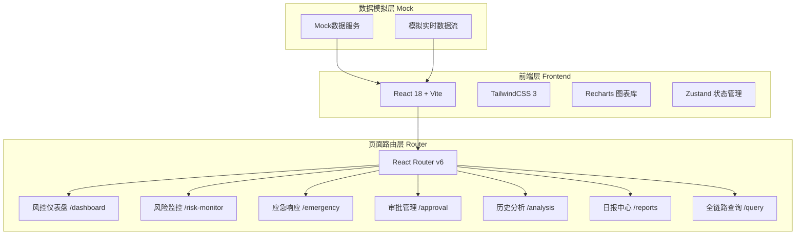
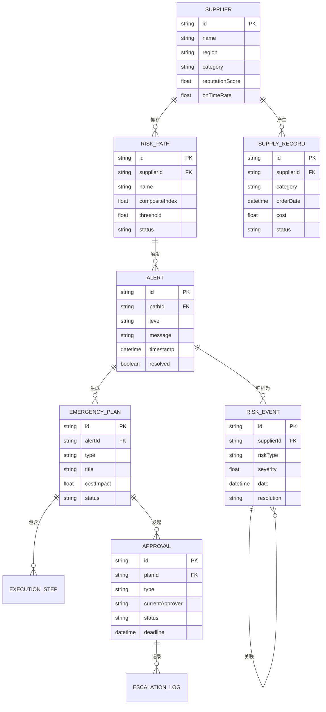

## 1. 架构设计



## 2. 技术说明

- **前端框架**：React@18 + TypeScript
- **构建工具**：Vite
- **样式方案**：TailwindCSS@3 + CSS Modules（玻璃拟态等特效）
- **图表库**：Recharts（折线图、柱状图、雷达图、面积图）
- **地图组件**：react-simple-maps（全球风险地图）
- **状态管理**：Zustand（轻量级全局状态）
- **路由**：React Router v6
- **图标**：Lucide React
- **动画**：Framer Motion
- **数据导出**：jsPDF + xlsx（PDF/Excel导出）
- **后端**：无后端，使用Mock数据模拟
- **数据库**：无数据库，使用内存Mock数据

## 3. 路由定义

| 路由 | 用途 |
|------|------|
| / | 重定向到 /dashboard |
| /dashboard | 风控仪表盘，全局风险总览 |
| /risk-monitor | 风险监控中心，多维模型与阈值管理 |
| /emergency | 应急响应中心，方案生成与执行追踪 |
| /approval | 审批管理中心，多级审批流程 |
| /analysis | 历史分析中心，事件关联与对比分析 |
| /reports | 日报报告中心，汇总报表与趋势图表 |
| /query | 全链路查询，组合查询与批量导出 |

## 4. API定义（Mock数据接口）

### 4.1 风控仪表盘接口

```typescript
interface KPIMetrics {
  globalRiskIndex: number;
  activeAlerts: number;
  onTimeDeliveryRate: number;
  costDeviationRate: number;
  pendingApprovals: number;
}

interface RiskTrendPoint {
  date: string;
  riskIndex: number;
  alertCount: number;
}

interface AlertItem {
  id: string;
  level: 'warning' | 'severe' | 'critical';
  supplier: string;
  category: string;
  riskIndex: number;
  message: string;
  timestamp: string;
}

interface MapDataPoint {
  supplierId: string;
  name: string;
  coordinates: [number, number];
  riskLevel: number;
  category: string;
}
```

### 4.2 风险监控接口

```typescript
interface RiskPath {
  id: string;
  name: string;
  dimensions: {
    supplierReputation: number;
    onTimeRate: number;
    logisticsRisk: number;
    tariffCost: number;
    exchangeRateVolatility: number;
  };
  compositeIndex: number;
  threshold: number;
  status: 'normal' | 'warning' | 'severe' | 'critical';
}

interface ThresholdConfig {
  category: string;
  warning: number;
  severe: number;
  critical: number;
}
```

### 4.3 应急响应接口

```typescript
interface EmergencyPlan {
  id: string;
  triggerAlertId: string;
  type: 'supplier_switch' | 'route_adjust' | 'fx_lock';
  title: string;
  description: string;
  costImpact: number;
  timeImpact: string;
  riskReduction: number;
  status: 'generated' | 'under_review' | 'approved' | 'executing' | 'completed';
  relatedHistoricalEvents: string[];
}

interface ExecutionStep {
  id: string;
  planId: string;
  step: number;
  title: string;
  assignee: string;
  status: 'pending' | 'in_progress' | 'completed';
  deadline: string;
  completedAt?: string;
}
```

### 4.4 审批管理接口

```typescript
interface ApprovalItem {
  id: string;
  planId: string;
  type: 'procurement_review' | 'finance_review' | 'legal_review';
  applicant: string;
  summary: string;
  costImpact: number;
  urgency: 'normal' | 'urgent' | 'critical';
  submittedAt: string;
  deadline: string;
  status: 'pending' | 'approved' | 'rejected' | 'escalated';
  currentApprover: string;
  escalatedFrom?: string;
}
```

### 4.5 历史分析接口

```typescript
interface RiskEvent {
  id: string;
  date: string;
  category: string;
  supplier: string;
  riskType: string;
  severity: number;
  resolution: string;
  resolutionTime: number;
  relatedEvents: string[];
}

interface ComparisonReport {
  currentEvent: RiskEvent;
  historicalEvents: RiskEvent[];
  differences: {
    field: string;
    currentValue: string;
    historicalValue: string;
  }[];
}
```

### 4.6 日报接口

```typescript
interface DailyReport {
  date: string;
  categorySummaries: {
    category: string;
    onTimeRate: number;
    costDeviation: number;
    riskEventCount: number;
    avgResolutionTime: number;
  }[];
  trendData: {
    date: string;
    onTimeRate: number;
    costDeviation: number;
    riskEvents: number;
  }[];
}
```

### 4.7 全链路查询接口

```typescript
interface QueryParams {
  supplier?: string;
  category?: string[];
  dateRange: { start: string; end: string };
  riskLevel?: string[];
}

interface SupplyChainRecord {
  id: string;
  supplier: string;
  category: string;
  orderDate: string;
  deliveryDate: string;
  status: string;
  riskEvents: string[];
  cost: number;
  path: string[];
}
```

## 5. 数据模型

### 5.1 数据模型定义



## 6. 项目目录结构

```
src/
├── components/           # 通用组件
│   ├── layout/          # 布局组件（侧边栏、顶栏、面包屑）
│   ├── cards/           # 卡片组件（KPI卡片、告警卡片、方案卡片）
│   ├── charts/          # 图表组件（折线图、雷达图、热力地图）
│   └── ui/              # 基础UI（按钮、徽章、下拉框、日期选择器）
├── pages/               # 页面组件
│   ├── Dashboard/       # 风控仪表盘
│   ├── RiskMonitor/     # 风险监控中心
│   ├── Emergency/       # 应急响应中心
│   ├── Approval/        # 审批管理中心
│   ├── Analysis/        # 历史分析中心
│   ├── Reports/         # 日报报告中心
│   └── Query/           # 全链路查询
├── stores/              # Zustand状态管理
├── mock/                # Mock数据与生成器
├── types/               # TypeScript类型定义
├── utils/               # 工具函数（导出、格式化等）
├── hooks/               # 自定义Hooks
├── App.tsx              # 应用入口
└── main.tsx             # 渲染入口
```
